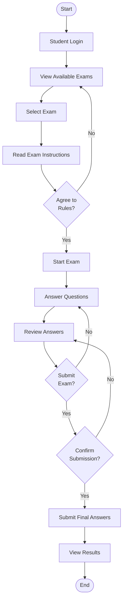
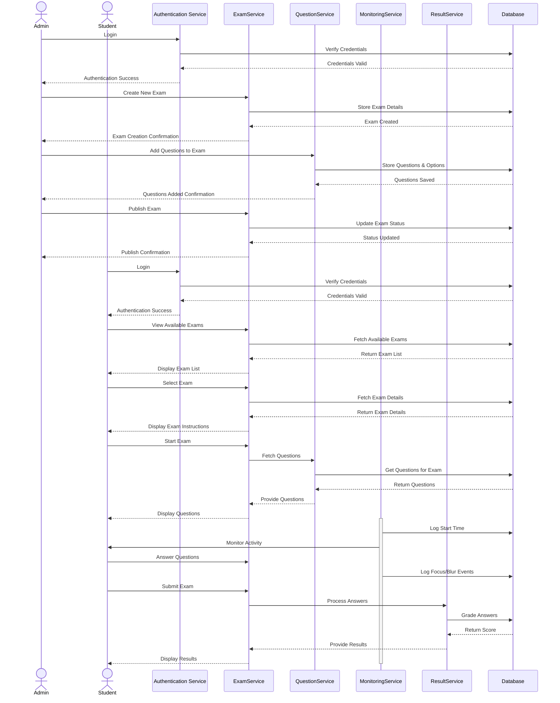
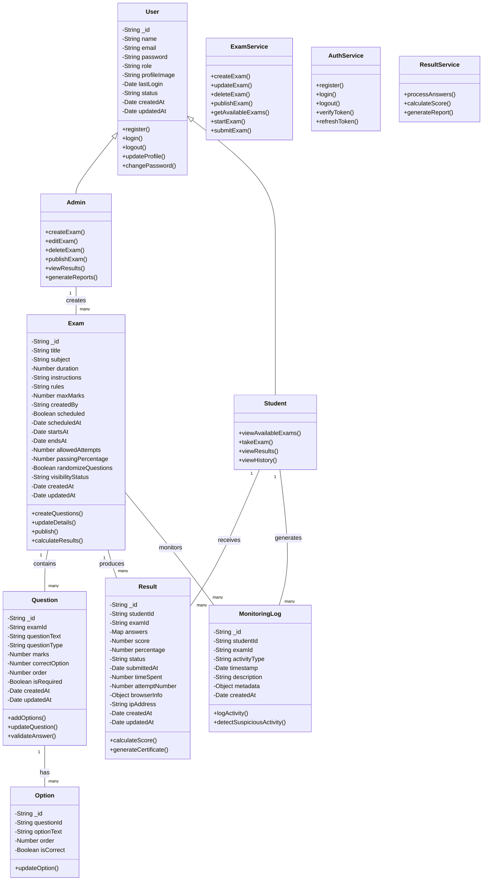
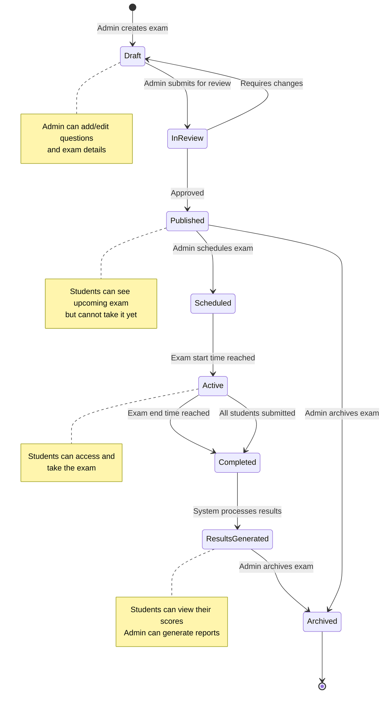
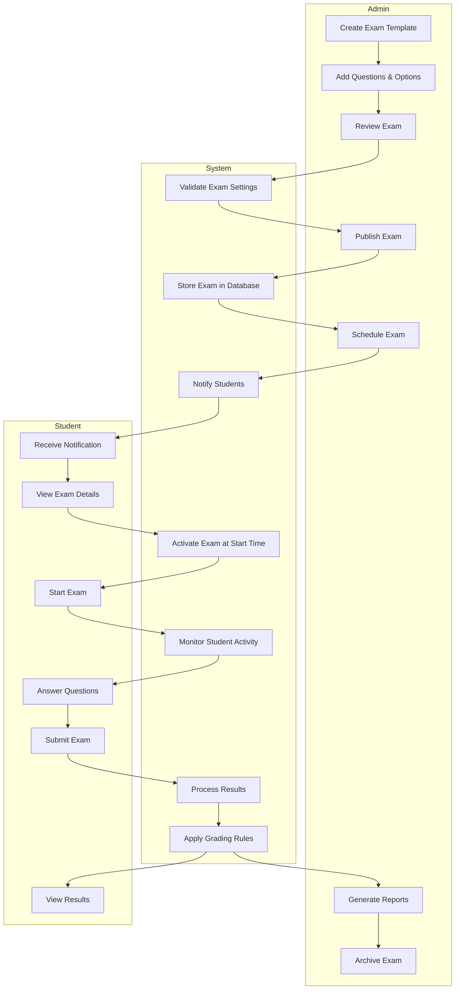
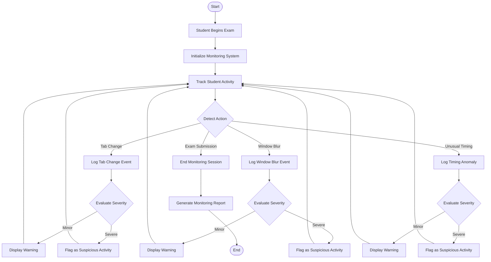
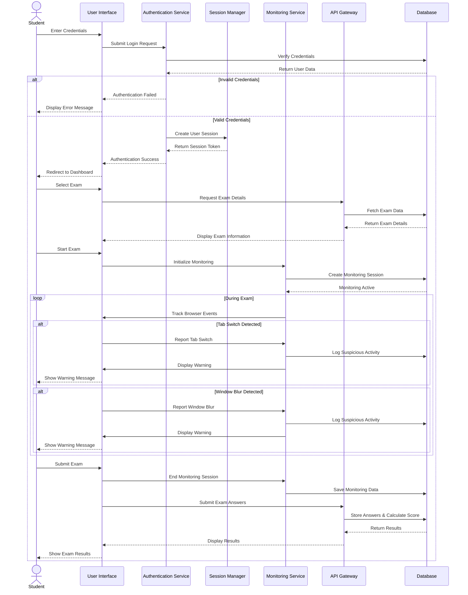

# ExamPortal Additional Diagrams

This document contains additional UML diagrams for the ExamPortal project, including Activity, Sequence, Class, State, and Swimlane diagrams.

## Activity Diagram: Exam Taking Process

## Sequence Diagram: Exam Creation and Taking Process

## Class Diagram: ExamPortal System

## State Diagram: Exam Lifecycle

## Swimlane Diagram: Exam Management Process

## Activity Diagram: Student Monitoring Process

## Sequence Diagram: Student Authentication and Monitoring

