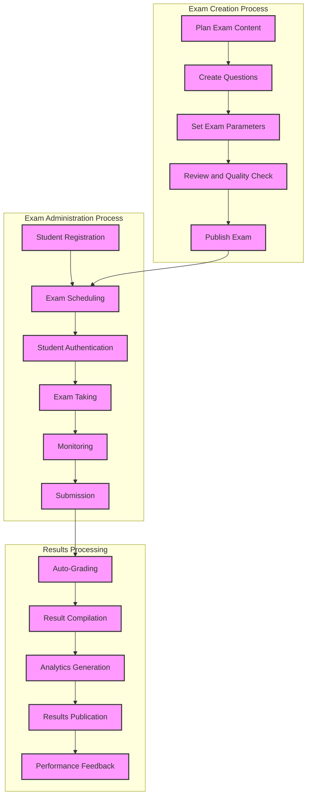
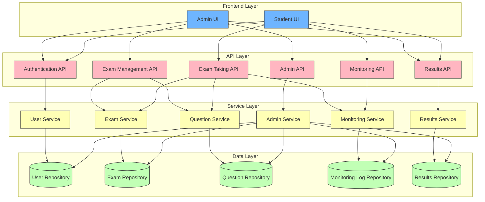
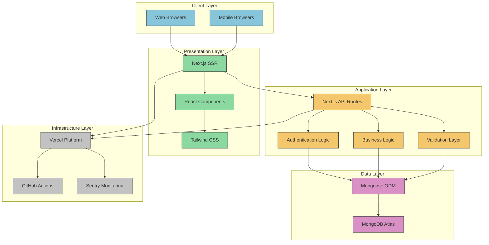
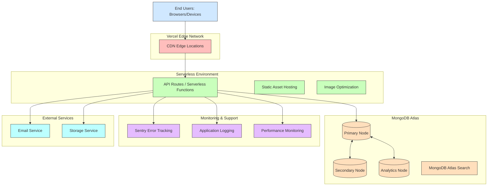
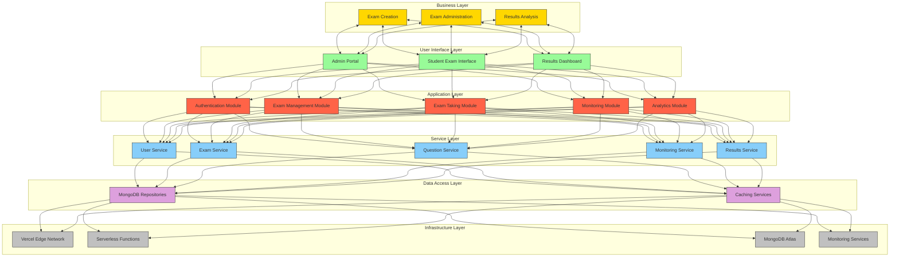

# ExamPortal Architecture Viewpoints

This document presents the ExamPortal system from four distinct architectural viewpoints: Business, Application, Technology, and Physical. Each viewpoint provides a different perspective on the system's architecture to address the concerns of different stakeholders.

## 1. Business Viewpoint

The Business Viewpoint focuses on the organizational context, business processes, and stakeholders involved in the ExamPortal system.

### 1.1 Key Business Processes

1. **Exam Creation Process**
   - Planning examination content
   - Creating and reviewing questions
   - Setting exam parameters and rules
   - Publishing exams to students

2. **Exam Administration Process**
   - Student registration and authentication
   - Exam scheduling and access control
   - Monitoring exam integrity
   - Results processing and publication

3. **Analytics and Reporting Process**
   - Performance data collection
   - Statistical analysis of results
   - Generating insights for educators
   - Continuous improvement of assessments

### 1.2 Stakeholders and Roles

| Stakeholder | Role | Primary Concerns |
|-------------|------|------------------|
| Educational Institutions | System owners | Overall system effectiveness, ROI, compliance |
| Administrators | Content creators & managers | Ease of exam creation, security, analytics |
| Students | End users | Usability, reliability, fairness |
| IT Staff | System maintenance | Performance, security, maintenance |
| Accreditation Bodies | External validators | Compliance, integrity, data protection |

### 1.3 Business Value Proposition

- **Cost Reduction**: Eliminates expenses associated with paper-based exams
- **Efficiency**: Automates grading and results processing
- **Accessibility**: Enables remote examination without geographical constraints
- **Scalability**: Supports large numbers of simultaneous examinations
- **Analytics**: Provides data-driven insights for educational improvement
- **Integrity**: Ensures examination security and prevents academic dishonesty

### 1.4 Business Process Diagram

## 2. Application Viewpoint

The Application Viewpoint describes the system's structure in terms of application components, their interactions, and the services they provide.

### 2.1 Application Components

1. **User Management Module**
   - Authentication and authorization
   - Profile management
   - Role-based access control

2. **Exam Management Module**
   - Exam creation and editing
   - Question bank management
   - Scheduling and publication

3. **Exam Taking Module**
   - Secure exam environment
   - Answer submission
   - Timer and navigation
   - Auto-save functionality

4. **Monitoring Module**
   - Tab switching detection
   - Activity logging
   - Real-time progress tracking
   - Suspicious activity alerts

5. **Results and Analytics Module**
   - Automated grading
   - Performance statistics
   - Result visualization
   - Data export capabilities

6. **Administration Module**
   - System configuration
   - User management
   - Audit logging
   - Backup and recovery

### 2.2 Application Interactions

| Component | Interacts With | Purpose |
|-----------|----------------|---------|
| User Management | All modules | Authentication, authorization |
| Exam Management | Results, Monitoring | Exam setup, question management |
| Exam Taking | Monitoring, Results | Student exam experience |
| Monitoring | Exam Taking, Administration | Integrity enforcement |
| Results & Analytics | Exam Management, Exam Taking | Performance assessment |
| Administration | All modules | System maintenance and configuration |

### 2.3 Application Architecture Diagram

## 3. Technology Viewpoint

The Technology Viewpoint describes the software and hardware technologies used to implement the system, including frameworks, libraries, and infrastructure components.

### 3.1 Technology Stack

| Layer | Technologies |
|-------|--------------|
| Frontend | Next.js 14, React 19, Tailwind CSS, Shadcn UI, Framer Motion |
| API & Backend | Next.js API Routes, RESTful API, WebSockets |
| Authentication | NextAuth.js, JWT, Bcrypt |
| Database | MongoDB, Mongoose ODM |
| DevOps | Vercel, GitHub Actions, Docker |
| Testing | Jest, React Testing Library, Cypress, Selenium |
| Monitoring | Sentry, Lighthouse, Custom logging |

### 3.2 Technology Dependencies

- **Node.js**: Runtime environment for server-side JavaScript
- **MongoDB Atlas**: Cloud database service for MongoDB
- **Vercel**: Cloud platform for deployment and hosting
- **NPM/Yarn**: Package managers for dependency management
- **Git**: Version control system
- **GitHub**: Repository hosting and CI/CD integration
- **Browser APIs**: For tab switching detection and viewport management

### 3.3 Technology Constraints

- Cross-browser compatibility requirements
- Mobile device performance considerations
- Internet connectivity dependencies
- Security requirements for sensitive exam data
- Scalability needs for concurrent exam sessions

### 3.4 Technology Architecture Diagram

## 4. Physical Viewpoint

The Physical Viewpoint describes the hardware and infrastructure components that host the ExamPortal system, including deployment architecture and network topology.

### 4.1 Deployment Environment

| Environment | Purpose | Characteristics |
|-------------|---------|-----------------|
| Development | Building and testing new features | Individual developer machines, local servers |
| Testing | Quality assurance and integration testing | Isolated cloud environment with test data |
| Staging | Pre-production validation | Mirror of production with synthetic load |
| Production | Live system for end users | High-availability, auto-scaling, real data |

### 4.2 Infrastructure Components

- **Edge Network**: Vercel's global CDN for static content delivery
- **Application Servers**: Serverless functions for API and dynamic content
- **Database Cluster**: MongoDB Atlas with primary and replica nodes
- **Storage Service**: For media and file storage
- **Monitoring & Logging**: Distributed tracing and centralized logging
- **Backup Systems**: Regular automated backups of database and configurations

### 4.3 Network Requirements

- **Bandwidth**: Sufficient to handle concurrent exam sessions
- **Latency**: Low latency for real-time monitoring features
- **Reliability**: High uptime guarantee for exam sessions
- **Security**: Encrypted connections (HTTPS/TLS)
- **Firewall Rules**: Protection against unauthorized access

### 4.4 Physical Architecture Diagram

## 5. Combined Architecture Overview

### 5.1 Architecture Principles

1. **Modularity**: System components are designed with clear boundaries and interfaces
2. **Scalability**: Architecture supports growth in users and functionality
3. **Security**: Security considerations are addressed at all levels
4. **Maintainability**: Code and infrastructure designed for long-term maintenance
5. **Responsiveness**: System optimized for performance across devices
6. **Resilience**: Fault tolerance built into critical components

### 5.2 Cross-Cutting Concerns

| Concern | Implementation Approach |
|---------|-------------------------|
| Security | JWT authentication, encrypted data, HTTPS, input validation |
| Logging | Centralized logging, structured log format, audit trails |
| Error Handling | Global error boundaries, graceful degradation, retry mechanisms |
| Performance | CDN, code splitting, optimized queries, caching strategies |
| Accessibility | WCAG compliance, semantic HTML, keyboard navigation |
| Internationalization | Text externalization, locale-aware formatting |

### 5.3 Integrated Architecture Diagram

## 6. Architecture Decision Records

| Decision ID | Decision | Rationale |
|-------------|----------|-----------|
| ADR-001 | Use Next.js for frontend & API | Unified development experience, SSR capabilities |
| ADR-002 | Use MongoDB as database | Schema flexibility, JSON-like document structure |
| ADR-003 | Deploy on Vercel | Seamless integration with Next.js, global CDN |
| ADR-004 | JWT for authentication | Stateless authentication, security, scalability |
| ADR-005 | Microservices-inspired modular structure | Maintainability, separation of concerns |
| ADR-006 | Client-side tab switching detection | Privacy concerns with webcam monitoring |
| ADR-007 | Serverless function deployment | Cost efficiency, auto-scaling capabilities | 