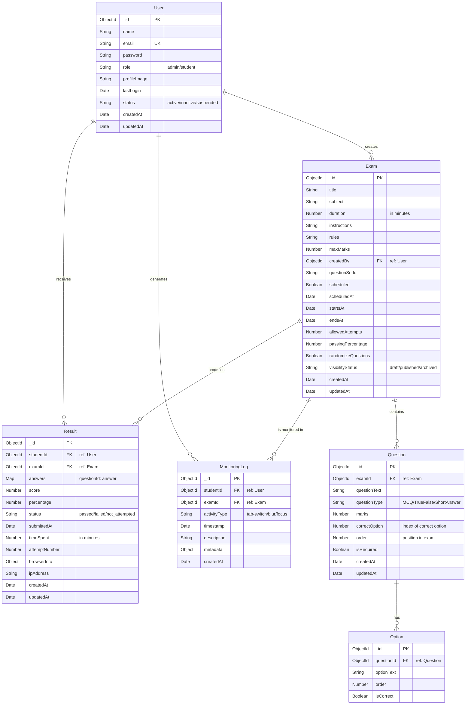

# ExamPortal Entity Relationship Diagram

The following Entity Relationship Diagram represents the database structure for the ExamPortal system, showing all entities, their attributes, and the relationships between them.

## Complete ER Diagram

## Entity Descriptions

### User
Represents any user in the system, can be an administrator or a student.
- **_id**: Unique identifier for the user
- **name**: Full name of the user
- **email**: Email address (unique)
- **password**: Hashed password
- **role**: Role of the user (admin/student)
- **profileImage**: URL to profile image
- **lastLogin**: Timestamp of last login
- **status**: Account status (active/inactive/suspended)
- **createdAt**: Timestamp when user was created
- **updatedAt**: Timestamp when user was last updated

### Exam
Represents an examination created by an administrator.
- **_id**: Unique identifier for the exam
- **title**: Title of the exam
- **subject**: Subject of the exam
- **duration**: Duration in minutes
- **instructions**: General instructions for students
- **rules**: Rules for taking the exam
- **maxMarks**: Maximum possible score
- **createdBy**: Reference to the User who created the exam
- **questionSetId**: Identifier for grouping questions
- **scheduled**: Whether the exam is scheduled
- **scheduledAt**: When the exam was scheduled
- **startsAt**: When the exam starts
- **endsAt**: When the exam ends
- **allowedAttempts**: Number of allowed attempts
- **passingPercentage**: Minimum percentage to pass
- **randomizeQuestions**: Whether questions should be randomized
- **visibilityStatus**: Current status (draft/published/archived)
- **createdAt**: Timestamp when exam was created
- **updatedAt**: Timestamp when exam was last updated

### Question
Represents a question in an exam.
- **_id**: Unique identifier for the question
- **examId**: Reference to the Exam
- **questionText**: The text of the question
- **questionType**: Type of question (MCQ/TrueFalse/ShortAnswer)
- **marks**: Marks allocated to this question
- **correctOption**: Index of the correct option (for MCQs)
- **order**: Position in the exam
- **isRequired**: Whether answering is mandatory
- **createdAt**: Timestamp when question was created
- **updatedAt**: Timestamp when question was last updated

### Option
Represents an option for a multiple-choice question.
- **_id**: Unique identifier for the option
- **questionId**: Reference to the Question
- **optionText**: Text of the option
- **order**: Display order
- **isCorrect**: Whether this is the correct option

### Result
Represents a student's result for an exam.
- **_id**: Unique identifier for the result
- **studentId**: Reference to the User (student)
- **examId**: Reference to the Exam
- **answers**: Map of question IDs to selected answers
- **score**: Numerical score achieved
- **percentage**: Score as a percentage of maximum marks
- **status**: Outcome status (passed/failed/not_attempted)
- **submittedAt**: When the exam was submitted
- **timeSpent**: Total time spent in minutes
- **attemptNumber**: Which attempt this was
- **browserInfo**: Browser information
- **ipAddress**: IP address of the student
- **createdAt**: Timestamp when result was created
- **updatedAt**: Timestamp when result was last updated

### MonitoringLog
Tracks student activities during an exam.
- **_id**: Unique identifier for the log entry
- **studentId**: Reference to the User (student)
- **examId**: Reference to the Exam
- **activityType**: Type of activity (tab-switch/blur/focus)
- **timestamp**: When the activity occurred
- **description**: Description of the activity
- **metadata**: Additional contextual data
- **createdAt**: Timestamp when log was created

## Relationship Descriptions

1. **User to Exam**: 
   - One-to-many relationship
   - An administrator can create multiple exams
   - Each exam is created by one administrator

2. **User to Result**:
   - One-to-many relationship
   - A student can have multiple exam results
   - Each result belongs to one student

3. **User to MonitoringLog**:
   - One-to-many relationship
   - A student can have multiple monitoring logs
   - Each log is associated with one student

4. **Exam to Question**:
   - One-to-many relationship
   - An exam contains multiple questions
   - Each question belongs to one exam

5. **Exam to Result**:
   - One-to-many relationship
   - An exam can have multiple results (from different students)
   - Each result is for one specific exam

6. **Question to Option**:
   - One-to-many relationship
   - A question (MCQ) has multiple options
   - Each option belongs to one question

7. **Exam to MonitoringLog**:
   - One-to-many relationship
   - An exam can have multiple monitoring logs
   - Each log is associated with one exam

## Database Indexes

For optimal performance, the following indexes should be created:

1. **User Collection**:
   - `email`: Unique index for fast lookups during authentication
   - `role`: Index for filtering users by role

2. **Exam Collection**:
   - `createdBy`: Index for finding exams created by a specific admin
   - `scheduled`, `startsAt`, `endsAt`: Compound index for finding active exams
   - `visibilityStatus`: Index for filtering by status

3. **Question Collection**:
   - `examId`: Index for finding all questions for a specific exam

4. **Result Collection**:
   - `studentId`: Index for finding all results for a specific student
   - `examId`: Index for finding all results for a specific exam
   - `studentId, examId`: Compound index for finding a specific student's result for a specific exam

5. **MonitoringLog Collection**:
   - `studentId, examId`: Compound index for finding all logs for a specific student in a specific exam
   - `timestamp`: Index for time-based queries 